# Computable Infinite Wordle: Two Variance Specifications with WASM Implementation

## Game Architecture

### Core Components
- **Secret**: A WebAssembly (WASM) binary representing a Turing machine that computes digits of a real number
- **Base**: Integer $b \ge 3$, with digits in $\{0, 1, \dots, b-1\}$
- **Interface**: WASM module exports a function `get_digit(index: string) -> uint64` where `index` is a hex-encoded position

## Variance A: Absolute Difference Feedback

**Rules:**
- Secret: Computable real $S = 0.s_1 s_2 s_3 \dots$ in base $b$, implemented as WASM module $W_S$
- Guess: Player uploads WASM binary $W_G$ implementing their hypothesized digit computer
- Feedback per digit position $p$:
  - 🟩 if $W_G(p) = W_S(p)$ exactly
  - 🟨 if $|W_G(p) - W_S(p)| = 1$
  - ⬛ if $|W_G(p) - W_S(p)| \ge 2$
- Digit adjacency: Linear graph (0—1—2—...—b-1)

## Variance B: Modular Difference Feedback

**Rules:**
- Same secret and guessing interface
- Feedback per digit position $p$:
  - 🟩 if $W_G(p) = W_S(p)$
  - 🟨 if $(W_G(p) - W_S(p)) \mod b \in \{1, b-1\}$
  - ⬛ otherwise
- Digit adjacency: Cyclic graph (0—1—2—...—b-1—0)

---

## WASM Verification Protocol

### Player's Upload Options:
1. **Binary Only**: Upload WASM binary $W_G$ without position queries
2. **Binary + Queries**: Upload $W_G$ with list of positions $[p_1, p_2, \dots, p_k]$ to test

### Verification Pipeline:

```mermaid
graph TD
    A[Player Upload] --> B{WITH Queries?};
    B -- YES --> C[Run Direct Comparison];
    C --> D{Any Feedback ≠ 🟩?};
    D -- YES --> E[Return Feedback];
    D -- NO --> F[Trigger Full Verification];
    
    B -- NO --> F;
    
    F --> G{Compare WASM Binaries};
    G -- EQUAL --> H[🏆 Immediate Win];
    G -- DIFFERENT --> I[Symbolic Execution];
    
    I --> J{Counterexample Found?};
    J -- YES --> K[Return First Counterexample];
    J -- NO --> L[Stochastic Sampling];
    
    L --> M{Counterexample Found?};
    M -- YES --> K;
    M -- NO --> N[Return Uncertain Result];
```



### Detailed Verification Stages:

#### Stage 1: Direct Comparison (When Queries Provided)
```python
def direct_comparison(secret_wasm, guess_wasm, positions, base, variance):
    feedback = []
    for pos in positions:
        s_digit = secret_wasm.get_digit(pos)
        g_digit = guess_wasm.get_digit(pos)
        
        if g_digit >= base:
            raise InvalidDigitError(f"Digit {g_digit} >= base {base}")
        
        if g_digit == s_digit:
            feedback.append(('🟩', pos, g_digit, s_digit))
        elif is_near(g_digit, s_digit, base, variance):
            feedback.append(('🟨', pos, g_digit, s_digit))
        else:
            feedback.append(('⬛', pos, g_digit, s_digit))
    
    return feedback
```

#### Stage 2: Binary Equality Check
```python
def binary_equality_check(secret_wasm_bytes, guess_wasm_bytes):
    # Normalize WASM binaries (strip debug info, canonicalize)
    secret_normalized = normalize_wasm(secret_wasm_bytes)
    guess_normalized = normalize_wasm(guess_wasm_bytes)
    
    if secret_normalized == guess_normalized:
        return "identical"  # Player wins immediately
    else:
        return "different"
```

#### Stage 3: Symbolic Execution
```python
def symbolic_verification(secret_wasm, guess_wasm, base, variance, timeout):
    """
    Attempt to find counterexample using symbolic execution
    Returns (found, counterexample_pos, reason) or (False, None, "timeout")
    """
    # Initialize symbolic position
    sym_pos = fresh_symbolic_int()
    
    # Execute both WASM modules symbolically
    s_result = secret_wasm.symbolic_execute(sym_pos)
    g_result = guess_wasm.symbolic_execute(sym_pos)
    
    # Constraint: 0 <= digit < base
    g_constraint = And(0 <= g_result, g_result < base)
    
    # Constraint: digits differ in a way visible via feedback
    if variance == "absolute":
        # Either not green AND not yellow
        not_green = g_result != s_result
        not_yellow = Abs(g_result - s_result) != 1
        diff_constraint = And(not_green, not_yellow)
    else:  # modular
        not_green = g_result != s_result
        mod_diff = (g_result - s_result) % base
        not_yellow = And(mod_diff != 1, mod_diff != base - 1)
        diff_constraint = And(not_green, not_yellow)
    
    # Combined constraint
    constraint = And(g_constraint, diff_constraint)
    
    # Solve with timeout
    result = solve_with_timeout(constraint, timeout)
    
    if result.sat:
        return True, result.model[sym_pos], f"counterexample at position {result.model[sym_pos]}"
    elif result.unsat:
        return False, None, "functionally equivalent under game rules"
    else:
        return False, None, "timeout"
```

#### Stage 4: Stochastic Sampling
```python
def stochastic_sampling(secret_wasm, guess_wasm, base, variance, max_samples):
    """
    Sample positions using Poisson process to find counterexamples
    """
    # Choose λ from Poisson(1), then sample positions from Poisson(λ)
    lambda_param = np.random.poisson(1)
    if lambda_param <= 0:
        lambda_param = 1
    
    # Generate sample positions
    positions = []
    current = 0
    while len(positions) < max_samples:
        # Sample from exponential with rate lambda_param
        wait = np.random.exponential(1/lambda_param)
        current += int(wait)
        if current < 2**64:  # Stay within uint64 range
            positions.append(current)
    
    # Test sampled positions
    for pos in positions:
        s_digit = secret_wasm.get_digit(str(hex(pos)))
        g_digit = guess_wasm.get_digit(str(hex(pos)))
        
        if g_digit >= base:
            return True, pos, f"invalid digit {g_digit} at position {pos}"
        
        if variance == "absolute":
            if abs(g_digit - s_digit) >= 2:
                return True, pos, f"black feedback at position {pos}"
        else:  # modular
            mod_diff = (g_digit - s_digit) % base
            if mod_diff not in [0, 1, base-1]:
                return True, pos, f"black feedback at position {pos}"
    
    return False, None, f"no counterexample in {max_samples} samples"
```

---

## Game Flow Implementation

### API Specification
```typescript
// WASM Module Interface
interface DigitComputer {
    get_digit(position_hex: string): number;
}

// Game API
interface GameResponse {
    type: 'feedback' | 'win' | 'uncertain' | 'error';
    data: Feedback[] | string;
}

interface Feedback {
    position: string;  // hex
    guess_digit: number;
    secret_digit?: number;  // revealed only for queried positions
    color: '🟩' | '🟨' | '⬛';
}

interface PlayerSubmission {
    wasm_binary: Uint8Array;
    query_positions?: string[];  // hex strings
    variance: 'absolute' | 'modular';
    base: number;
}
```

### Game Logic
```python
class WASMInfiniteWordle:
    def __init__(self, secret_wasm_bytes: bytes, base: int):
        self.secret_wasm = compile_wasm(secret_wasm_bytes)
        self.base = base
        self.game_state = 'active'
        
    def play_turn(self, submission: PlayerSubmission) -> GameResponse:
        # Validate base
        if submission.base != self.base:
            return error_response("Base mismatch")
        
        if submission.base >= 2**64:
            return error_response("Base too large for uint64")
        
        # Compile player's WASM
        try:
            guess_wasm = compile_wasm(submission.wasm_binary)
        except:
            return error_response("Invalid WASM binary")
        
        # Case 1: With queries
        if submission.query_positions:
            feedback = direct_comparison(
                self.secret_wasm, guess_wasm,
                submission.query_positions,
                submission.base, submission.variance
            )
            
            # Check if any non-green feedback
            non_green = any(f[0] != '🟩' for f in feedback)
            if non_green:
                return {
                    'type': 'feedback',
                    'data': format_feedback(feedback, reveal_secret=True)
                }
            # All green - trigger full verification
            return self.full_verification(guess_wasm, submission.variance)
        
        # Case 2: No queries - immediate full verification
        return self.full_verification(guess_wasm, submission.variance)
    
    def full_verification(self, guess_wasm, variance) -> GameResponse:
        # Stage 1: Binary comparison
        binary_result = binary_equality_check(
            self.secret_wasm.bytes, guess_wasm.bytes
        )
        if binary_result == "identical":
            self.game_state = 'won'
            return {'type': 'win', 'data': 'WASM binaries are identical!'}
        
        # Stage 2: Symbolic execution (10 second timeout)
        sym_result = symbolic_verification(
            self.secret_wasm, guess_wasm,
            self.base, variance, timeout=10
        )
        
        if sym_result[0]:  # Counterexample found
            pos, digit = test_single_position(sym_result[1])
            return {
                'type': 'feedback',
                'data': [{
                    'position': hex(sym_result[1]),
                    'guess_digit': guess_wasm.get_digit(hex(sym_result[1])),
                    'secret_digit': digit,
                    'color': classify_feedback(guess_digit, digit, self.base, variance)
                }]
            }
        
        # Stage 3: Stochastic sampling
        sample_result = stochastic_sampling(
            self.secret_wasm, guess_wasm,
            self.base, variance, max_samples=1000
        )
        
        if sample_result[0]:
            return {
                'type': 'feedback',
                'data': [format_counterexample(sample_result)]
            }
        
        # No counterexample found
        return {
            'type': 'uncertain',
            'data': 'No counterexample found via symbolic execution or ' +
                   'random sampling (1000 positions). Your guess might be ' +
                   'functionally equivalent, or a counterexample exists ' +
                   'beyond tested positions.'
        }
```

---

## Strategic Implications with WASM

### New Considerations:
1. **Binary Identical Wins**: Players can win immediately by submitting identical WASM
2. **Symbolic Analysis**: Advanced players can use formal methods to prove equivalence
3. **Partial Testing**: Querying specific positions before full submission
4. **Counterexample Search**: The game actively searches for disproofs

### Optimal Strategies:

**For Variance A (Absolute):**
```python
# Exploit endpoint information
def optimal_probe_absolute(base):
    # First, test if digit is endpoint
    probe_positions = [1, 2, 3]  # Early positions
    probe_digits = [0, base-1, base//2]  # Test boundaries and middle
    # Submit WASM that returns these digits at specified positions
```

**For Variance B (Modular):**
```python
# Uniform probing strategy
def optimal_probe_modular(base):
    # All digits are symmetric
    probe_digits = [0, 1, base//2]
    # Strategy focuses on distinguishing cyclic neighbors
```

### Example Game Session:

**Setup:**
```javascript
// Secret: Number with repeating pattern 0,1,2,3,0,1,2,3,...
const secretWASM = `
(module
  (func (export "get_digit") (param $pos i64) (result i64)
    local.get $pos
    i64.const 4
    i64.rem_u
    return)
)`;

// Player's guess: Thinks it's repeating pattern 1,2,3,0,1,2,3,0,...
const guessWASM = `
(module
  (func (export "get_digit") (param $pos i64) (result i64)
    local.get $pos
    i64.const 1
    i64.add
    i64.const 4
    i64.rem_u
    return)
)`;
```

**Turn 1 (with queries):**
```json
{
  "wasm_binary": "0x...",
  "query_positions": ["0x0", "0x1", "0x2", "0x3"],
  "variance": "modular",
  "base": 4
}
```

**Response:**
```json
{
  "type": "feedback",
  "data": [
    {"position": "0x0", "guess_digit": 1, "secret_digit": 0, "color": "🟨"},
    {"position": "0x1", "guess_digit": 2, "secret_digit": 1, "color": "🟨"},
    {"position": "0x2", "guess_digit": 3, "secret_digit": 2, "color": "🟨"},
    {"position": "0x3", "guess_digit": 0, "secret_digit": 3, "color": "🟨"}
  ]
}
```

**Turn 2 (binary only):**
```json
{
  "wasm_binary": "0x...",  // Corrected WASM
  "variance": "modular",
  "base": 4
}
```

**Response (after verification):**
```json
{
  "type": "win",
  "data": "WASM binaries are identical!"
}
```

---

## Theoretical Analysis

### Complexity Results:
1. **Equivalence Checking**: Determining if two WASM modules produce identical digit sequences is undecidable in general
2. **Game Winnability**: With computable secrets and the verification pipeline, players can always win in finite time by:
   - Enumerating possible WASM modules
   - Using queries to prune search space
   - Eventually finding identical or functionally equivalent module

### Verification Strength:
- **Symbolic Execution**: Can prove equivalence for simple programs
- **Stochastic Sampling**: Probabilistic guarantee: if programs differ on significant portion of positions, likely to find counterexample
- **Combined Approach**: Balance between deep analysis (symbolic) and broad coverage (sampling)

### Base Scaling Effects:

| Base | WASM Verification Complexity | Typical Turns to Win |
|------|-----------------------------|---------------------|
| 3-10 | Low (symbolic often works) | 5-15 |
| 10-100 | Medium | 15-50 |
| 100+ | High (sampling dominant) | 50+ |

---

## Implementation Notes

### WASM Security Considerations:
1. **Resource Limits**: Time and memory constraints on execution
2. **Sandboxing**: Isolated execution environment
3. **Validation**: Ensure WASM only uses permitted operations
4. **Determinism**: Guarantee reproducible digit computation

### Performance Optimizations:
1. **Caching**: Store computed digits for frequently accessed positions
2. **Parallel Verification**: Test multiple positions simultaneously
3. **Incremental Symbolic Execution**: Build on previous verification results
4. **Adaptive Sampling**: Focus sampling on positions likely to differ

### Extensions:
1. **Collaborative Mode**: Multiple players work together
2. **Tournament Mode**: Same secret, competing to find it fastest
3. **Difficulty Levels**: Restrict WASM complexity (max instructions, memory)
4. **Hint System**: Reveal additional feedback after certain number of turns

---

## Research Questions

1. **Verification Completeness**: What class of WASM programs can be fully verified by the pipeline?
2. **Optimal Sampling Strategy**: What's the optimal Poisson λ for finding counterexamples?
3. **Game-Theoretic Analysis**: Nash equilibrium strategies for different base sizes
4. **Complexity Classes**: Relating game difficulty to computational complexity hierarchies
5. **Learning-Theoretic Perspective**: PAC-learning of computable reals via this feedback model

This refined specification maintains the mathematical foundation while adding practical implementation details for a playable game with rigorous verification mechanisms.
